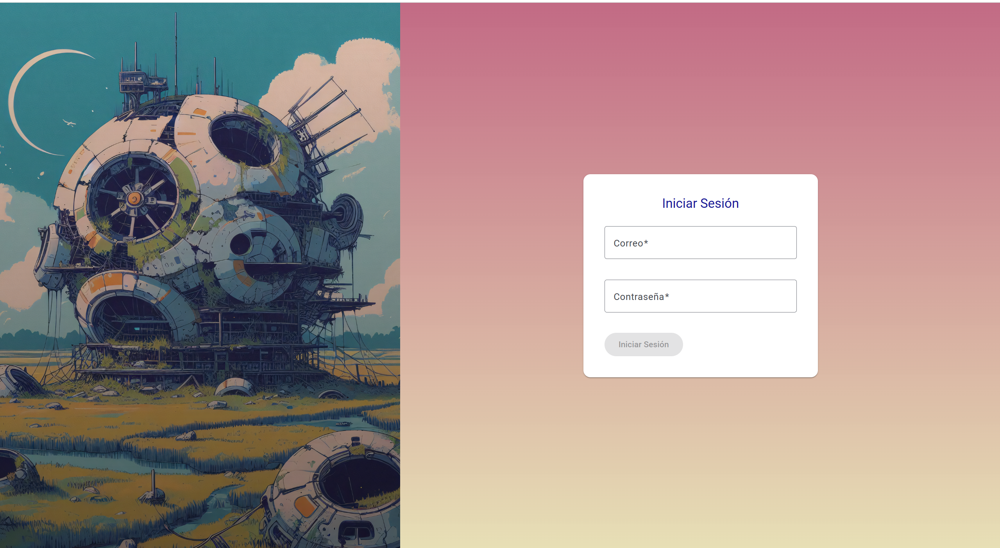
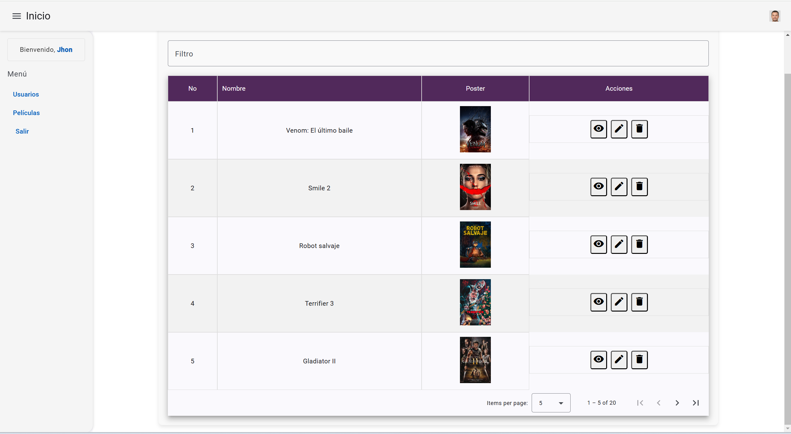
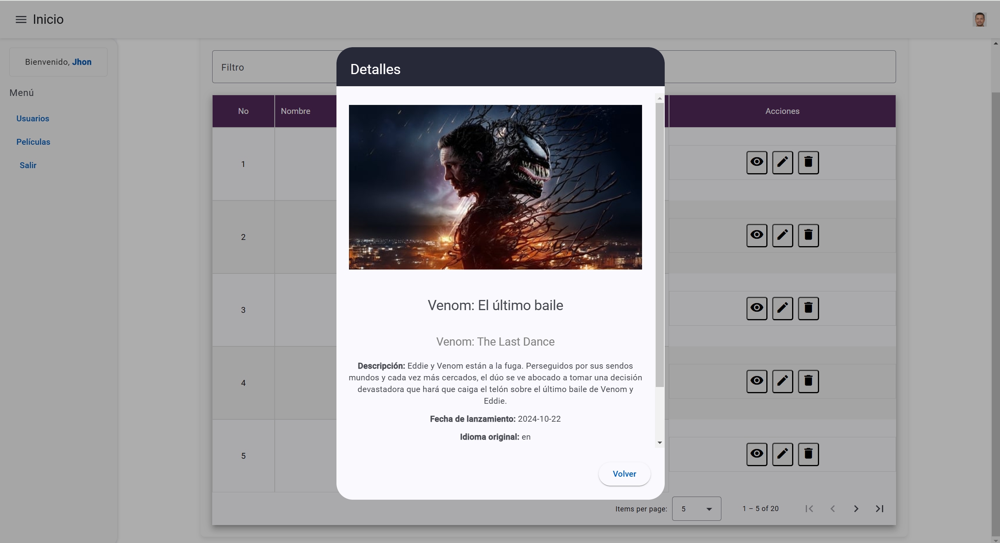
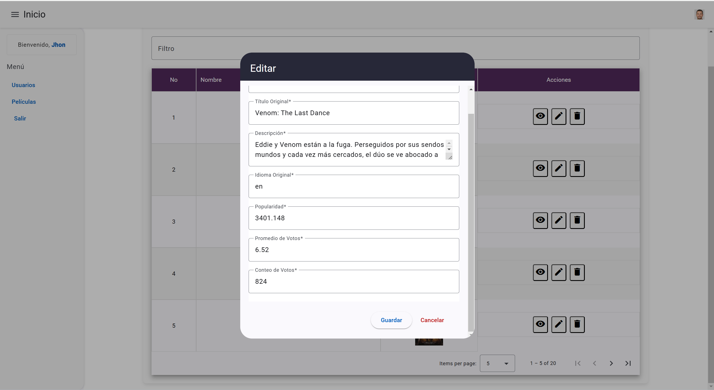
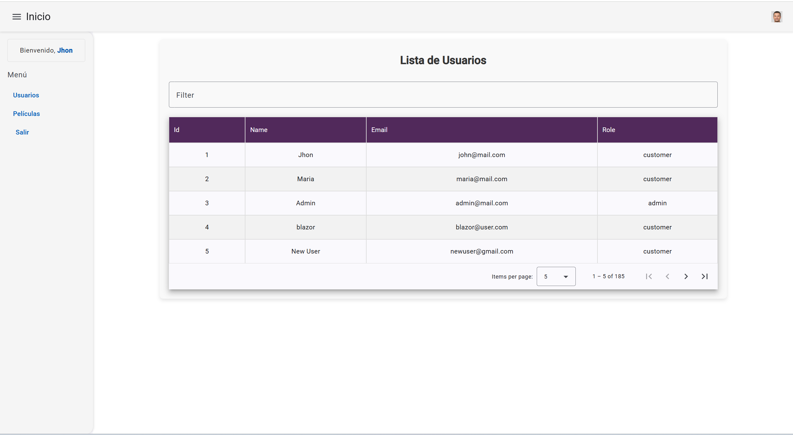

# Proyecto de Consumo de API de TMDb 🎬

Este proyecto consume la API pública de **The Movie Database (TMDb)**. Permite a los usuarios explorar datos relacionados con películas, series y actores utilizando la API Key proporcionada por TMDb.

``` link
https://developer.themoviedb.org/docs/getting-started
```

## Características

- Buscar información sobre películas, series y actores.
- Explorar las películas más populares o las tendencias actuales.
- Detalles completos sobre una película, como sinopsis, elenco y puntuación.
- Fácil de configurar y usar con cualquier API Key válida de TMDb.

## Servicio: PeliculaService

```typescript
import { HttpClient, HttpParams } from '@angular/common/http';
import { Injectable } from '@angular/core';
import { Observable } from 'rxjs';

@Injectable({
  providedIn: 'root'
})
export class PeliculaService {

  private baseUrl: string = 'https://api.themoviedb.org/3/movie/now_playing';
  private apiKey: string = '8b20d78728b45c912d0ecf5d761b98d4';

  constructor(private http: HttpClient) {}

  getNowPlaying(language: string = 'es-ES', page: number = 1): Observable<any> {
    const params = new HttpParams()
      .set('language', language)
      .set('page', page.toString())
      .set('api_key', this.apiKey);

    return this.http.get(this.baseUrl, { params });
  }

}
```

El servicio `PeliculaService` utiliza Angular para interactuar con la API de **The Movie Database (TMDb)** y obtener la lista de películas actualmente en cartelera.

### 📋 Funcionalidad
- Método `getNowPlaying(language: string, page: number)`:  
  Realiza una solicitud `GET` a la URL `https://api.themoviedb.org/3/movie/now_playing` con los siguientes parámetros:
  - **`language`**: Idioma de los resultados (por defecto: `es-ES`).
  - **`page`**: Número de página para paginación (por defecto: `1`).
  - **`api_key`**: Clave de autenticación para acceder a la API.

### 🛠️ Implementación
1. **HTTP Client**: Utiliza el servicio `HttpClient` de Angular para realizar solicitudes.
2. **Parámetros**: Usa `HttpParams` para construir los parámetros de consulta dinámicamente.
3. **Respuesta**: Devuelve un `Observable` con los datos proporcionados por TMDb.


## TablaPeliculasComponent

``` Typescript 
@Component({
  selector: 'app-tabla-peliculas',
  standalone: true,
  imports: [
    MatTableModule,
    MatPaginatorModule,
    MatFormFieldModule,
    MatInputModule,
    MatIcon,
    MatSortModule
  ],
  templateUrl: './tabla-peliculas.component.html',
  styleUrl: './tabla-peliculas.component.css'
})
export class TablaPeliculasComponent implements OnInit, AfterViewInit {

  peliculas: Pelicula[] = [];
  peliculasEliminadas: Pelicula[] = [];
  displayedColumns: string[] = ['numero', 'nombre', 'poster', 'accion'];
  dataSource = new MatTableDataSource<Pelicula>();

  @ViewChild(MatPaginator) paginator: MatPaginator;
  @ViewChild(MatSort) sort: MatSort;

  constructor(private peliculaService: PeliculaService,
    private localService: GuardarLocalService
  ) { }

  ngOnInit(): void {
    this.dataSource.filterPredicate = (data: Pelicula, filter: string) => {
      return data.titulo.toLowerCase().includes(filter.trim().toLowerCase());
    };
    this.obtenerPeliculas();
  }

  obtenerPeliculas(){
    this.peliculaService.getNowPlaying().pipe(
      map(response => response.results.map((data: any) => new Pelicula(data)))
    ).subscribe({
      next: (datos) => {
        this.peliculas = datos;
        this.dataSource.data = this.peliculas;
        console.log(this.peliculas);
        //this.actualizarContenido();
      },
      error: (errores) => {
        console.log(errores);
      }
    });
  }

  ngAfterViewInit() {
    this.dataSource.paginator = this.paginator;
    this.dataSource.sort = this.sort;
  }

  applyFilter(event: Event) {
    const filterValue = (event.target as HTMLInputElement).value;
    this.dataSource.filter = filterValue.trim().toLowerCase();
  }

  readonly dialog = inject(MatDialog);

  masDetalles(pelicula: Pelicula) {
    let edicion: boolean = false;
    const dialogRef = this.dialog.open(ModalComponent, {
      width: '600px',
      data: { pelicula, edicion }
    });

    dialogRef.afterClosed().subscribe(result => {
      console.log(`Dialog result: ${result}`);
    });
  }

  editar(pelicula: Pelicula) {
    let edicion: boolean = true;
    const dialogRef = this.dialog.open(ModalComponent, {
      width: '600px',
      data: { pelicula, edicion }
    });

    dialogRef.afterClosed().subscribe((peliculaActualizada: Pelicula | undefined) => {
      console.log(`Dialog result: ${peliculaActualizada}`);
      if (peliculaActualizada) {
        const index = this.peliculas.findIndex(p => p.id === peliculaActualizada.id);
        this.peliculas[index] = peliculaActualizada;
      }
      console.log(this.peliculas);
      this.dataSource.data = this.peliculas;
    });
  }

  eliminar(pelicula: Pelicula) {
    Swal.fire({
      title: "¿Estas Seguro?",
      text: "¡No podras Revertir la accion!",
      icon: "warning",
      showCancelButton: true,
      confirmButtonColor: "#3085d6",
      cancelButtonColor: "#d33",
      confirmButtonText: "¡Si, eliminar!",
      cancelButtonText: "Cancelar"
    }).then((result) => {
      if (result.isConfirmed) {
        Swal.fire({
          title: "¡Eliminado!",
          text: "El elemento fue borrado.",
          icon: "success"
        });
        
        this.peliculasEliminadas.push(pelicula);
        this.peliculas = this.peliculas.filter(
          pelicula => !this.peliculasEliminadas.some(eliminada => eliminada.id === pelicula.id)
        );
        this.dataSource.data = this.peliculas;
      }
    });

  }

}

```


Componente Angular para gestionar una tabla interactiva de películas, integrando funcionalidades de búsqueda, paginación, ordenamiento, y acciones como editar, eliminar y ver detalles.

### ✨ Características
- **Búsqueda**: Filtra películas por nombre utilizando un input.
- **Paginar y Ordenar**: Implementado con `MatPaginator` y `MatSort`.
- **Acciones**:
  - `masDetalles`: Abre un modal para mostrar detalles de una película.
  - `editar`: Permite editar los datos de una película.
  - `eliminar`: Confirma y elimina una película de la lista con `SweetAlert2`.

### 🧩 Código Principal
- **Métodos Clave**:
  - `obtenerPeliculas()`: Consume la API de TMDb para obtener películas en cartelera.
  - `applyFilter()`: Aplica el filtro de búsqueda en la tabla.
  - `eliminar(pelicula)`: Elimina una película, actualizando el `dataSource`.

- **Uso de Servicios**:
  - `PeliculaService`: Para obtener datos desde la API de TMDb.


## Lista de Películas - Interfaz Angular Material

``` HTML
<div class="container">
    <h2>Lista de Peliculas</h2>
    <mat-form-field appearance="outline">
      <mat-label>Filtro</mat-label>
      <input matInput (keyup)="applyFilter($event)" placeholder="Ingrese su busqueda" #input >
    </mat-form-field>
  
    <div class="mat-elevation-z8">
      <table mat-table [dataSource]="dataSource" class="table-striped table-bordered " matSort>
        <!-- Position Column -->
        <ng-container matColumnDef="numero">
            <th mat-header-cell *matHeaderCellDef>No</th>
            <td mat-cell *matCellDef="let movie; let i = index">
              {{ i + 1 + (paginator.pageIndex * paginator.pageSize) }}
            </td>
          </ng-container>
  
        <!-- Symbol Column -->
        <ng-container matColumnDef="nombre">
          <th mat-header-cell *matHeaderCellDef mat-sort-header>Nombre</th>
          <td mat-cell *matCellDef="let movie">{{ movie.titulo }}</td>
        </ng-container>
  
        <!-- Name Column -->
        <ng-container matColumnDef="poster">
          <th mat-header-cell *matHeaderCellDef>Poster</th>
          <td mat-cell *matCellDef="let movie">
            
          </td>
        </ng-container>
  
        <!-- Symbol Column -->
        <ng-container matColumnDef="accion">
          <th mat-header-cell *matHeaderCellDef>Acciones</th>
          <td mat-cell *matCellDef="let movie" class="acciones-cell">
            <button mat-icon-button color="primary" (click)="masDetalles(movie)" class="boton-accion">
              <mat-icon>visibility</mat-icon>
            </button>
            <button mat-icon-button color="accent" (click)="editar(movie)" class="boton-accion">
              <mat-icon>edit</mat-icon>
            </button>
            <button mat-icon-button color="warn" (click)="eliminar(movie)" class="boton-accion">
              <mat-icon>delete</mat-icon>
            </button>
          </td>
        </ng-container>
          
  
        <tr mat-header-row *matHeaderRowDef="displayedColumns"></tr>
        <tr mat-row *matRowDef="let row; columns: displayedColumns"></tr>
      </table>
  
      <mat-paginator
        [pageSizeOptions]="[5, 10, 20]"
        showFirstLastButtons
        aria-label="Select page of periodic movies"
      >
      </mat-paginator>
    </div>
  </div>
```

Este componente presenta una tabla interactiva para mostrar una lista de películas utilizando Angular Material. Incluye funcionalidades como filtros, paginación, ordenamiento y acciones para cada elemento.

### ✨ Características
- **Búsqueda**: Campo de texto para filtrar películas por nombre.
- **Ordenamiento**: Ordena las columnas utilizando el encabezado interactivo.
- **Paginar**: Control de paginación con opciones configurables de tamaño de página.
- **Acciones**: Botones para realizar acciones (ver detalles, editar, eliminar) en cada película.

### 🧩 Estructura del Código
- **Campo de Búsqueda**:  
  Usa un `<mat-form-field>` con un input que activa el método `applyFilter()` al presionar una tecla.
  
- **Tabla**:  
  Implementada con `<table mat-table>` que utiliza las siguientes columnas:
  - **`numero`**: Índice calculado dinámicamente.
  - **`nombre`**: Nombre de la película.
  - **`poster`**: Imagen de la película.
  - **`accion`**: Botones para acciones específicas.

- **Paginador**:  
  Configurado con `<mat-paginator>` para navegación entre páginas.


## Dashboard de la Aplicación con Angular Material

``` Typescript
import { Component, inject, OnInit } from '@angular/core';
import { MatButtonModule } from '@angular/material/button';
import { MatCardModule } from '@angular/material/card';
import { MatToolbarModule } from '@angular/material/toolbar';
import { Router, RouterLink, RouterOutlet } from '@angular/router';
import { MatDialog, MatDialogModule } from '@angular/material/dialog';
import Swal from 'sweetalert2';
import { MatMenuModule } from '@angular/material/menu';
import { UsuarioLoggedService } from '../services/usuario-logged.service';
import { Usuario } from '../models/usuario';
import { MatSidenavModule } from '@angular/material/sidenav';
import { MatIcon } from '@angular/material/icon';

@Component({
  selector: 'app-dashboard',
  standalone: true,
  imports: [
    MatToolbarModule,
    MatButtonModule,
    MatCardModule,
    RouterOutlet,
    MatButtonModule, 
    MatDialogModule,
    RouterLink,
    MatMenuModule,
    MatSidenavModule,
    MatIcon
  ],
  templateUrl: './dashboard.component.html',
  styleUrl: './dashboard.component.css'
})
export class DashboardComponent implements OnInit{

  showFiller = false;
  usuario: Usuario | null;

  constructor(private router: Router, 
    public logeadoService: UsuarioLoggedService
  ){}

  ngOnInit(): void {
    console.log(this.logeadoService.getUsuario()?.avatar);
    this.usuario = this.logeadoService.getUsuario();
  }

  salir(){

    Swal.fire({
      title: "¿Estas seguro de salir?",
      text: "Se cerrara la session",
      icon: "warning",
      showCancelButton: true,
      confirmButtonColor: "#3085d6",
      cancelButtonColor: "#d33",
      confirmButtonText: "Si, Salir",
      cancelButtonText: "Cancelar"
    }).then((result) => {
      if (result.isConfirmed) {
        Swal.fire({
          title: "Se ha cerrado la sesion!",
          text: "Session cerrada.",
          icon: "success"
        });
        this.logeadoService.clearUsuario();
        this.router.navigate(['login']);
      }
    });

    
  }

}

```

El componente `DashboardComponent` proporciona la estructura principal para el panel de control de la aplicación. Incluye una barra de herramientas, un menú lateral y funcionalidades relacionadas con la sesión del usuario.

### ✨ Características
- **Visualización del Usuario**:
  - Muestra información del usuario logeado, como el avatar y el nombre.

- **Acción de Cerrar Sesión**:
  - Confirma la acción mediante un cuadro de diálogo utilizando **SweetAlert2**.
  - Borra los datos del usuario del servicio `UsuarioLoggedService` y redirige a la página de inicio de sesión.

- **Navegación Dinámica**:
  - Utiliza `Router` para manejar la navegación entre vistas.
  - Soporta rutas declaradas mediante `RouterLink`.

### 📄 Descripción de Funcionalidades
1. **Inicialización (`ngOnInit`)**:
   - Obtiene el usuario logeado desde el servicio `UsuarioLoggedService` y carga su información.
   - Imprime la URL del avatar en la consola para depuración.

2. **Cerrar Sesión (`salir`)**:
   - Solicita confirmación al usuario para cerrar la sesión.
   - Si se confirma, muestra una alerta de éxito, limpia la información del usuario y redirige al componente de inicio de sesión.

3. **Barra de Herramientas y Menú Lateral**:
   - Utiliza Angular Material para crear un diseño visualmente atractivo y funcional.
   - Implementa un botón que abre o cierra el menú lateral.


## Menú de Navegación con Angular Material

``` HTML
<div class="container">
  <mat-toolbar color="primary" class="fixed-toolbar">
    <button mat-icon-button (click)="drawer.toggle()">
      <mat-icon>menu</mat-icon>
    </button>
    <span>Inicio</span>
    <span class="spacer"></span>
    <button mat-icon-button [matMenuTriggerFor]="menu" class="avatar-button">
      
    </button>
    <mat-menu #menu="matMenu">
      <button mat-menu-item (click)="salir()">Salir</button>
    </mat-menu>
  </mat-toolbar>

  <mat-drawer-container class="drawer-container">
    <mat-drawer #drawer class="example-sidenav" mode="side">
      <div class="welcome-section">
        <p class="welcome-message">
          Bienvenido, <span>{{ logeadoService.getUsuario()?.name }}</span>
        </p>
      </div>
      <p>Menú</p>
      <button mat-button routerLink="usuarios">Usuarios</button>
      <button mat-button routerLink="peliculas">Películas</button>
      <button mat-button (click)="salir()">Salir</button>
    </mat-drawer>

    <mat-drawer-content>
      <div class="example-sidenav-content">
        <router-outlet></router-outlet>
      </div>
    </mat-drawer-content>
  </mat-drawer-container>
</div>

```


Este código implementa un menú lateral (drawer) y una barra superior fija utilizando Angular Material. Proporciona una interfaz de navegación clara y funcional para una aplicación web.

### ✨ Características
- **Barra Superior (`mat-toolbar`)**:
  - Botón para abrir/cerrar el menú lateral.
  - Muestra un avatar del usuario (dinámico) obtenido del servicio `logeadoService`.
  - Incluye un menú desplegable para acciones adicionales (como "Salir").

- **Menú Lateral (`mat-drawer`)**:
  - Contiene un mensaje de bienvenida personalizado.
  - Botones para navegar entre módulos (`Usuarios`, `Películas`) utilizando `routerLink`.
  - Opción para cerrar sesión.

- **Área de Contenido (`mat-drawer-content`)**:
  - Renderiza vistas dinámicamente con `router-outlet`.

### 📄 Estructura Principal
- **Toolbar Superior**:
  - **Botón Menú**: Abre o cierra el menú lateral.
  - **Avatar**: Muestra el avatar del usuario logeado.
  - **Menú Desplegable**: Acción de cerrar sesión.

- **Menú Lateral**:
  - Botones de navegación.
  - Mensaje de bienvenida dinámico basado en el nombre del usuario.

- **Contenido Principal**:
  - Área donde se renderizan las rutas de la aplicación.


# Imagenes de la Interfaz

<div align='center'>
    
    <p>Interfaz para el inicio de sesion</p>
</div>

<div align='center'>
    
    <p>Tabla de Peliculas actuales en cartelera</p>
</div>

<div align='center'>
    
    <p>Modal para poder observar los detalles de la pelicula</p>
</div>

<div align='center'>
    
    <p>Modal para poder editar los detalles de la pelicula</p>
</div>

<div align='center'>
    
    <p>Tabla de Usuarios que pueden ingresar</p>
</div>
